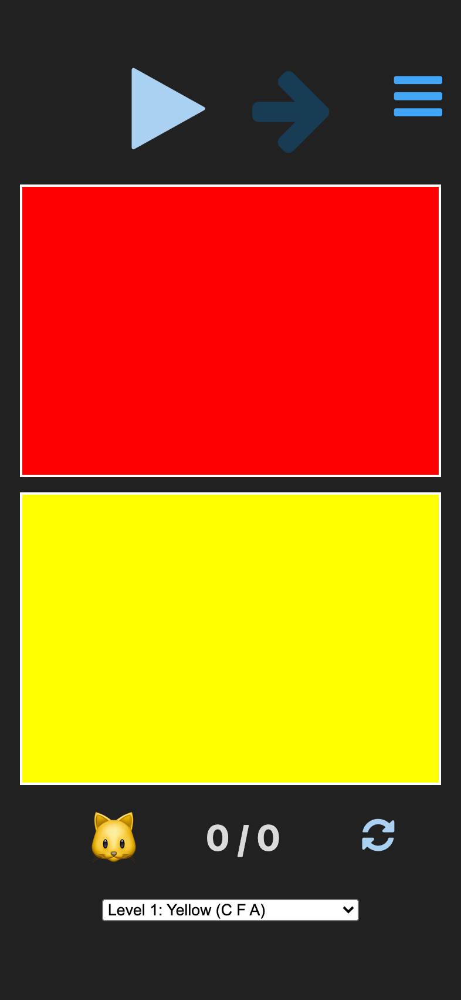
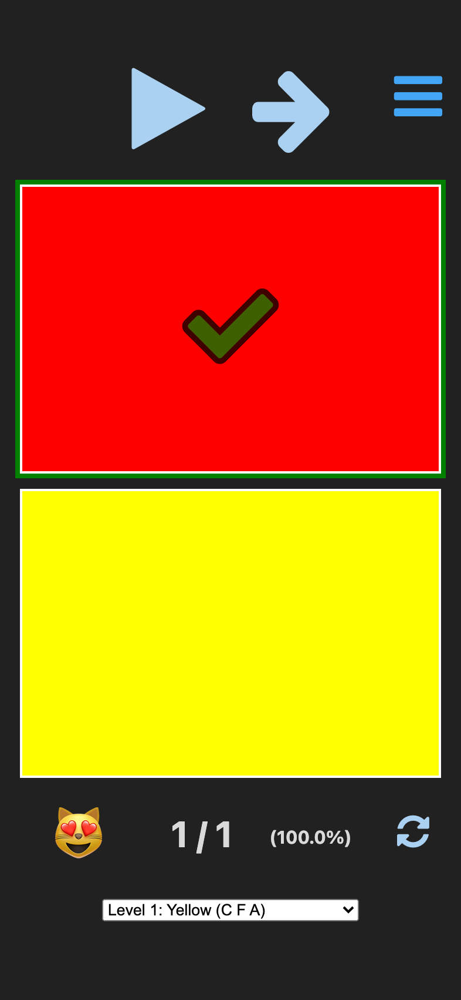
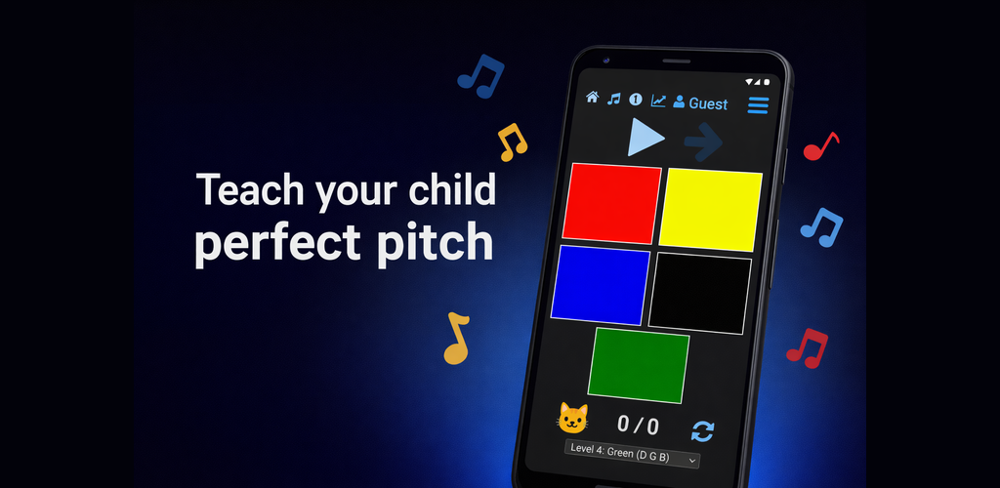

# BSharp: Perfect Pitch Trainer

Young children can acquire absolute (perfect) pitch — but adults cannot. The window closes around age 6. BSharp helps develop this ability using Eguchi's chord identification method.

<p align="center">
  <a href="https://play.google.com/store/apps/details?id=com.bsharp.app">
    
  </a>
</p>

<p align="center">
  <a href="https://play.google.com/store/apps/details?id=com.bsharp.app">
    <strong>See it on the Play Store</strong>
  </a>
</p>

## How it Works

Children listen to piano chords and learn to identify each one by its color. Start with two chords (red and yellow) and gradually introduce new ones as your child masters each level. Practice 5 times a day for 2–3 minutes each session — about 20–25 identifications.

<p align="center">
  <a href="https://play.google.com/store/apps/details?id=com.bsharp.app">
    
    
  </a>
</p>

## About the Eguchi Method

Eguchi's chord identification method was documented in research published in Psychology of Music. Children associate chords with colors (red, yellow, blue, black, green, orange, purple, pink, brown) and progress through levels. New chords should be introduced no sooner than every 2 weeks, and only after the child can identify all current chords with 100% accuracy.

Based on the [open-source CIM Trainer](https://github.com/pganssle/cim) by Paul Ganssle.

## Using BSharp

<p align="center">
  <a href="https://play.google.com/store/apps/details?id=com.bsharp.app">
    
  </a>
</p>

Children listen to a chord and tap the matching colored flag. The app tracks accuracy, adjusts chord frequency using an adaptive weighting algorithm (presenting harder chords more often), and supports multiple user profiles.

**Chord progression:**

| Level | Color | Chord |
|-------|-------|-------|
| 1 | Yellow | F/C |
| 2 | Blue | G/B |
| 3 | Black | F/A |
| 4 | Green | G/D |
| 5 | Orange | C/E |
| 6 | Purple | F |
| 7 | Pink | G |
| 8 | Brown | C/G |

After mastering the 9 white-key chords, 5 black-key chords are introduced (Gray, Tan, Light Green, Light Purple, Sky Blue).

# Developer 

## Building

Requires Node.js.

```bash
npm install
make build
```

This produces `dist/` with the bundled app.

## Android

```bash
make android-deploy
```

Then open `android/` in Android Studio, sync Gradle, and run on a device or emulator.

## Attribution

Derived from [pganssle/cim](https://github.com/pganssle/cim) by Paul Ganssle. Rebuilt as a separate tool with a distinct name at his [request](https://github.com/pganssle/cim/pull/62#issuecomment-4017584766). Licensed under the Apache License 2.0. See [NOTICE](NOTICE) for details.
